# Tài liệu Lệnh Linux (Markdown)

## Các phím tắt
- **Ctrl + A**: Di chuyển con trỏ đến đầu dòng
- **Ctrl + E**: Di chuyển con trỏ đến cuối dòng
- **Ctrl + U**: Xóa từ vị trí con trỏ đến đầu dòng
- **Ctrl + K**: Xóa từ vị trí con trỏ đến cuối dòng
- **Alt + B/F**: Di chuyển con trỏ sang trái/phải một từ
- **Mở tab mới**: `Ctrl + Shift + T`
- **Đóng tab hiện tại**: `Ctrl + Shift + W`

## Lệnh Quản lý Thư mục

### `ls -R`
Hiển thị toàn bộ cây thư mục và tập tin con bên trong.

### `mkdir`
Tạo mới một thư mục.
- **Flag:** `-p` (parent) – Tạo thư mục con cả khi chưa có thư mục cha.

### `rmdir`
Xóa thư mục rỗng.
- **Flag:**
  - `-p` – Xóa cả thư mục cha.

### `rm`
Xóa tập tin hoặc thư mục.
- **Flag:**
  - `-i`: Đưa ra thông báo trước khi xóa.
  - `-r`, `--recursive`: Xóa tất cả các tệp và thư mục con bên trong thư mục được chỉ định.
  - `-f`, `--force`: Bỏ qua các thông báo xác nhận và xóa các tệp được bảo vệ khỏi ghi mà không cần hỏi.

### `tree`
Hiển thị cây thư mục.
- **Cú pháp:** `tree [directory]`
- **Flag:**
  - `-L [số]` – Lấy từ mấy thư mục con.
- **Ví dụ:** `tree -L 1 /` – Lấy một thư mục con từ root.

  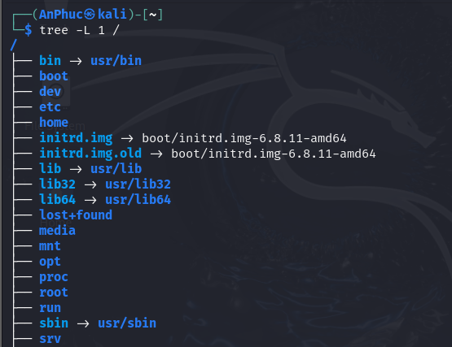

### `du` (disk usage)
- Hiển thị thông tin về dung lượng sử dụng trên đĩa.

  
  - **-h**: hiển thị giá trị con người có thể đọc được
## Lệnh Quản lý Tập tin

### `touch`
Tạo tập tin rỗng.

### `echo`
Tạo tập tin với nội dung sử dụng echo, hoặc thêm dòng cho nội dung có sẵn.
- **Ví dụ:** `echo "asdsad" >> text.txt`

### `cat`
Sử dụng để xem nội dung bên trong tập tin.

### `cp`
Sao chép tập tin.
- **Flag:**
  - `-R`, `-r`: Sao chép toàn bộ thư mục.

### `mv`
Lệnh di chuyển tập tin hoặc đổi tên của tập tin.
- **Flag:**
  - `-i`: Nhắc trước khi di chuyển với tập tin/thư mục đích đã tồn tại.
  - `-f`: Ghi đè khi di chuyển tới tập tin/thư mục đã tồn tại.

## Ký tự đại diện (Wildcards)
- `?`: Sử dụng để đại diện cho một ký tự bất kỳ trong một mẫu tìm kiếm.
- `*`: Sử dụng để đại diện cho bất kỳ chuỗi ký tự nào (gồm cả chuỗi rỗng).

## Lệnh Xem nội dung tập tin

### `more` và `less`
- **more**: Hiển thị tệp tin theo từng trang.
- **less**: Hiển thị tệp tin một cách tương tác.

### `head` và `tail`
- `head`: Xem 10 dòng đầu tiên của một tệp.
- `tail`: Xem 10 dòng cuối cùng của một tệp.
- **Flag:**
  - `-n`: Chọn số dòng muốn hiển thị.
  - `-f`: Theo dõi và hiển thị những công việc tiếp theo sẽ thực thi.

### `wc`
In ra số dòng, số từ và số chữ trong một tệp.
- **Flag:**
  - `-w`: word
  - `-l`: line
  - `-c`: character

## Định hướng nhập, xuất, cơ chế đường ống

**Ký hiệu:** `>` `<` `>>` `|`

- `>`: Xuất dữ liệu ra file, xóa dữ liệu file nếu file cũ đã tồn tại.
- `>>`: Xuất dữ liệu và ghi thêm dữ liệu vào cuối file.
- `<`: Nhập dữ liệu từ file.
- `|` (dấu pipe): Được sử dụng để kết nối đầu ra của một lệnh với đầu vào của một lệnh khác, dữ liệu trước của đầu ra được truyền sang dữ liệu sau và thực hiện câu lệnh đó.

  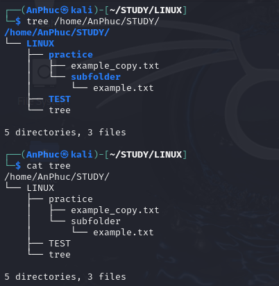

## Lệnh Tìm kiếm

### `grep`
Tìm kiếm văn bản dòng lệnh, chuỗi ký tự trong file hoặc thư mục.
- **Flag:**
  - `-c`: Đếm số lần xuất hiện của string (count).
  - `-i`: Bỏ qua phân biệt hoa thường.
  - `-v`: Lọc kết quả không khớp.
  - `-n`: Hiển thị số dòng của từ tìm kiếm trong file.
  - `-E`: Sử dụng biểu thức chính quy để tìm kiếm.
  - `-o`: Chỉ trùng với cấu trúc.

### `find`
Tìm kiếm tập tin hoặc thư mục. Có thể tìm theo tên, thời gian, nhóm, userID, …
- **Flag:**
  - `-name`: Tên.
  - `-atime`, `-mtime`, `-ctime`: Dựa trên thời gian truy cập, sửa đổi, hoặc tạo.
  - `-perm`: Quyền truy cập.
  - `-size`: Kích thước.

  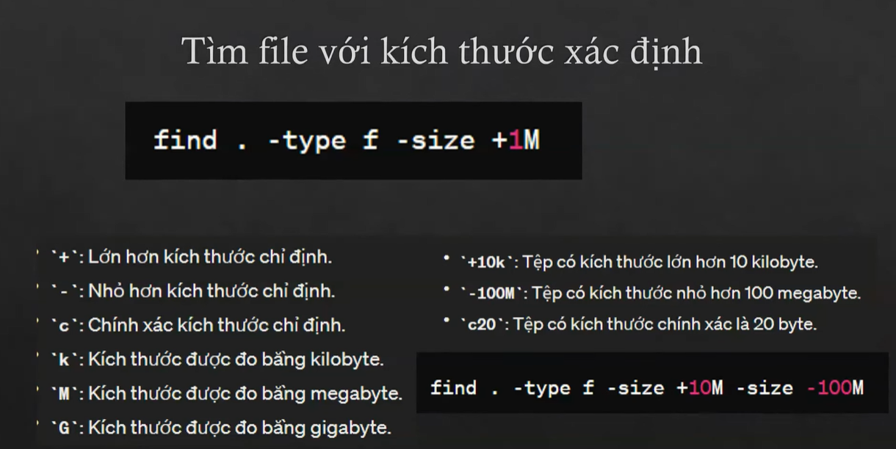

  - `-type f`: Tìm file.
  - `-gid`, `-uid`: Nhóm, người dùng.
  - `-maxdepth`: Tìm kiếm theo chiều sâu của thư mục con.
  - `-exec` (thực thi): Sử dụng để thực thi một lệnh khác.
    - `{}` => đại diện cho tập hợp toàn bộ lệnh ở phía trước.
    - `\;` => dấu kết thúc cho lệnh.

  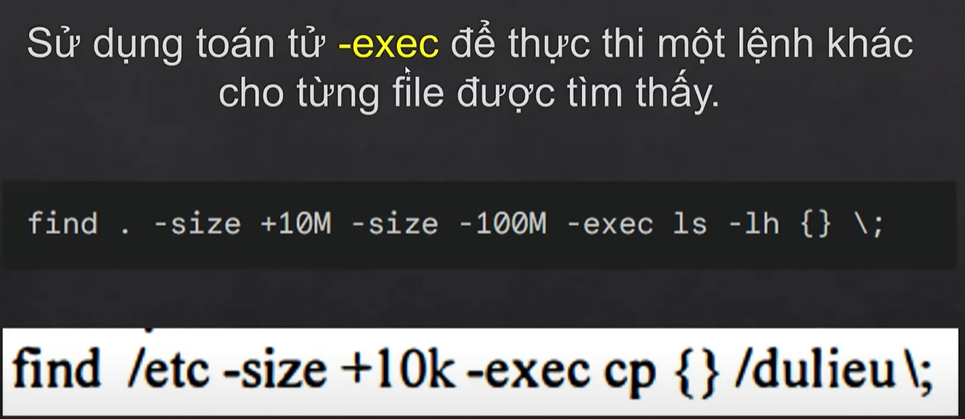

**Ví dụ:**
```
sudo find . -type f -printf "%f %g %u %m %M %p %y\n" | awk '{printf "%-20s %-10s %-10s %-5s %-5s %-5s %-5s\n", $1, $2, $3, $4, $5, $6, $7}'
```

  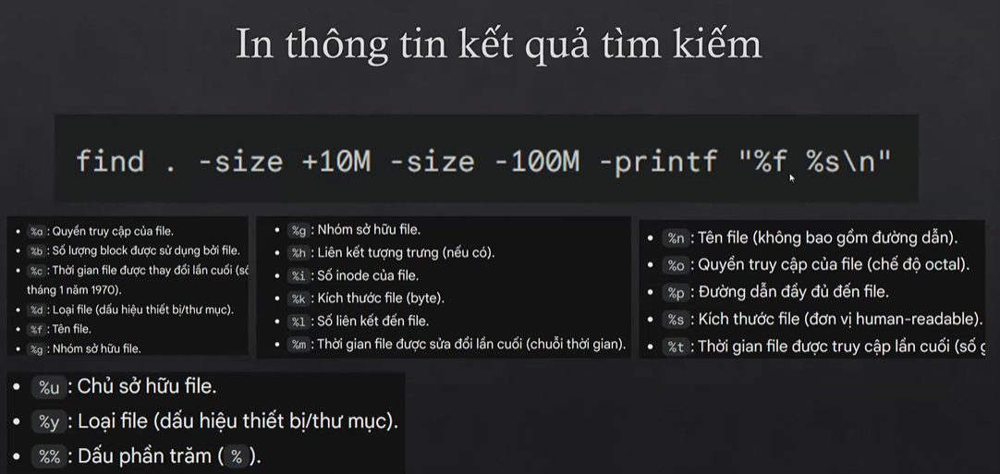

### `whereis`
Tìm kiếm và hiển thị ra các tệp thực thi, tệp nguồn, và tệp hướng dẫn của lệnh đó.
- **Flag:**
  - `-b`: Tìm file thực thi.
  - `-m`: Tìm file mã nguồn.
  - `-s`: Tìm trang man.
  - `-u`: Tìm trong thư mục do người dùng cài đặt.

### `which`
Tìm kiếm và hiển thị ra tệp thực thi trong đường dẫn hệ thống => chỉ hiển thị tệp đầu tiên được tìm thấy.
- **Ví dụ:** `which bash`, `which ls`

### `whatis`
Trả về một mô tả ngắn giới thiệu về cách sử dụng của lệnh.
- **Ví dụ:** `whatis ls`, `whatis cat`, …

## Nén và giải nén tập tin

### Gzip và Gunzip
- **Cú pháp:** `gzip [option] [file]` và `gunzip`
- **Flag:**
  - `-c`, `--stdout`: In ra kết quả giải nén trên màn hình.
  - `-d`: Giải nén tập tin được nén, hoặc sử dụng `gunzip`.
  - `-f`, `--force`: Bắt buộc nén tệp tin mà không hỏi lại người dùng.
  - `-r`: Nén tất cả các tệp tin trong thư mục và các thư mục con.

### Tar
- **Cú pháp:** `tar option [file..]`
- **Flag:**
  - `-c`, `--create`: Tạo một tệp tin nén mới.
  - `-x`, `--extract`: Giải nén một tệp tin nén đã tồn tại.
  - `-f`, `--file`: Đặt tên cho tệp tin nén.
  - `-v`: Hiển thị thông tin chi tiết về quá trình làm việc.
  - `-z`, `--gzip`: Sử dụng nén gzip khi tạo hoặc giải nén.
  - `-j`, `--bzip2`: Sử dụng nén bzip2 khi tạo hoặc giải nén.
  - `-r`: Thêm các tệp tin vào tệp tin nén đã tồn tại.
  - `-t`, `--list`: Liệt kê nội dung của tệp tin nén mà không giải nén.

## Trình soạn thảo VI

- Không có giao diện, hướng màn hình.
- Cho phép người dùng sử dụng bàn phím để chỉnh sửa, thay đổi.
- **Mở file:** `vi [file name]`

### Chế độ làm việc của vi
Khi mở file vi thì mới đầu vào sẽ là chế độ sử dụng dòng lệnh, để chuyển sang chế độ văn bản ta sử dụng `:i`, `a` và ngược lại chuyển từ text mode sang command mode ta nhấn `esc`.

- **Command mode**: Sử dụng các lệnh để làm việc.
- **Text mode**: Chỉnh sửa văn bản.

Để thoát khỏi vi ta phải đang ở chế độ command mode và thực hiện các lệnh thoát:
- Thoát và không lưu: `:q!`
- Thoát và lưu: `:x`, `:wq`

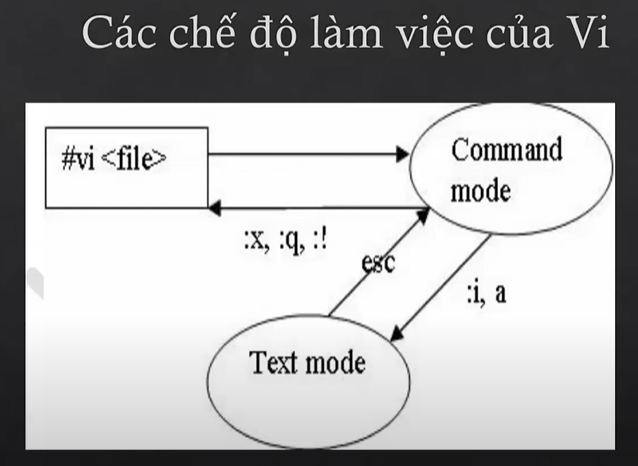

### Tất tần tật các lệnh trong vi

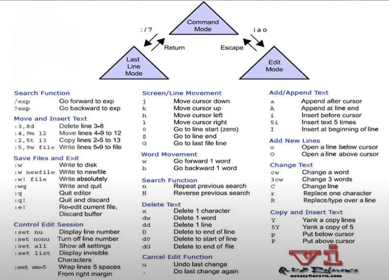

#### Những câu lệnh tối thiểu cần phải nhớ
- `:set nu`: Hiển thị số dòng của file.
- `:set nonu`: Không hiển thị số dòng.
- `dd`: Xóa dòng ngay vị trí con trỏ.
- `dG`: Xóa từ vị trí con trỏ đến cuối file (`G`: tổ hợp shift + g).
- `:n`: Di chuyển con trỏ đến dòng số n.
- `u`: Undo.
- `/text`: Tìm kiếm từ "text" trong file, dùng phím `n` để xem kết quả kế tiếp.

#### Nhóm lệnh khi chèn đoạn văn bản
- `i`: Trước dấu con trỏ.
- `l`: Sau ký tự đầu tiên trên dòng.
- `a`: Sau dấu con trỏ.
- `A`: Sau ký tự cuối cùng trên dòng.
- `o`: Dưới dòng hiện tại.
- `O`: Trên dòng hiện tại.
- `r`: Thay thế 1 ký tự hiện hành.
- `R`: Thay thế cho đến khi nhấn.

#### Nhóm lệnh di chuyển với con trỏ
- `v`: Bôi đen từ vị trí con trỏ để sử dụng các câu lệnh.
- `V`: Bôi đen từ vị trí đầu đến cuối câu ở vị trí có con trỏ.
- `b`: Sang trái 1 space với ký tự đầu.
- `e`: Sang trái 1 space với ký tự cuối.
- `w`: Sang trái 1 space với ký tự đầu.
- `h`/`j`/`k`/`l`: Move cursor left/down/up/right.
- `H`/`M`/`L`: Di chuyển con trỏ lên đầu/giữa/cuối trang.
- `(` / `)`: Đầu câu và cuối câu.
- `{` / `}`: Đầu đoạn, cuối đoạn văn.
- `0`, `Home`: Di chuyển đến đầu hàng.
- `$`, `End`: Di chuyển đến cuối hàng.
- `G`: Di chuyển đến cuối dòng của file.

#### Nhóm lệnh xóa
- `ndw` (n là số từ): Xóa n từ.
- `dd`: Xóa một dòng.
- `x`: Xóa 1 ký tự.

#### Nhóm lệnh tìm kiếm
- `?`, `n`: Tìm trở lên.
- `/`, `N`: Tìm trở xuống.
- `*/An`: Tìm từ kế tiếp của "An".
- `*?An`: Tìm từ kết thúc là "An".

#### Tìm kiếm và thay thế
- `:s/text1/text2/g`: Thay thế text1 = text2 ngay vị trí con trỏ chuột => thêm `%` trước `:` để thay thế toàn bộ text.

#### Copy, paste, undo
- `y`: Copy.
- `p`: Paste.
- `y$`: Copy từ vị trí hiện tại đến vị trí cuối cùng.
- `nyy`: Copy n dòng liên tiếp.
- `u`: Undo lại thao tác trước đó.

## Lệnh cut – cắt và trích xuất

### `cut`
Cắt từ trong một tập tin.
- **Flag:**
  - `-b`: Cắt theo byte.
  - `-c`: Cắt theo số phần tử từ n-m.
  - `-f`: field, cắt theo trường.
  - `-d`: Xác định ký tự ngăn cách giữa các trường dữ liệu.

## Reconnaissance web tools

## Biểu thức chính quy
Giúp tìm kiếm, thay thế theo một cấu trúc mẫu văn bản nào đó.

## Quản lý tiến trình
- `sudo`: super user do.
- `top`: Sử dụng để xem các tiến trình đang hoạt động, CPU, vv.
  - **PID**: Tiến trình -> nhấn `s` để thay đổi thời gian làm mới -> sử dụng `l` để lọc ra các tiến trình đang chạy, các ct không hoạt động sẽ không hiển thị.
  - `k`: kill, sử dụng để tắt một tiến trình sử dụng PID.
- `pidof [tên tiến trình]`: Tìm ra được PID của một tiến trình.
- `kill`: Tắt một tiến trình.
  - `-KILL`, `-9`: Những flag được sử dụng để đóng tiến trình một cách ép buộc và mạnh hơn so với lệnh kill thông thường.

## Phân quyền hệ thống file và thư mục

### Các ký hiệu về phân quyền
**Ví dụ:** `-rw-rw-r-- 1` → type of file - owner - group - other user

Dòng đầu tiên nếu là:
- `-`: Là một tệp bình thường.
- `d`: Là thư mục.
- `c`: Là ký tự đặc biệt.
- `b`: Là một tệp nhị phân.

Các quyền:
- `r`: Quyền đọc.
- `w`: Quyền viết.
- `x`: Quyền thực thi.

### Câu lệnh `chmod`
Sử dụng `chmod` để thay đổi quyền.
- `a`: all
- `g`: group
- `u`: owner
- `o`: others
- `+`: Thêm quyền.
- `-`: Bớt quyền.

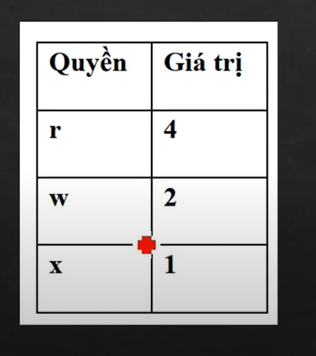

- **Ví dụ:** `chmod ug+wr pass_mysql.txt`
- `-R`: Áp dụng đối với thư mục, làm cho lệnh có tác dụng lên tất cả các thư mục con.
- **Directory permission**: Thay đổi quyền của một thư mục.

### Octal and Numerical permissions (chmod)
`r w x = 1 1 1 = 7` (binary)

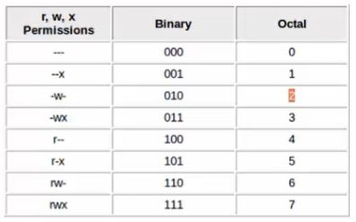

- **Ví dụ:** `chmod 764` = `-rwxrw-r--`

### `chown`
Đổi người sở hữu tập tin.

### `chgrp`
Đổi nhóm sở hữu mới.

## Hard link và Symbolic link

### LINKS
Cách để tạo ra một tham chiếu tới các tệp hoặc thư mục khác. Có 2 loại tham chiếu: hard link và symbolic link.

### Hard link

  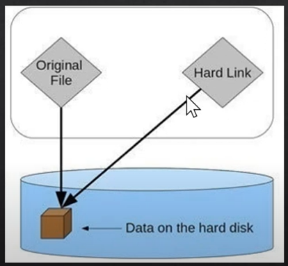

- Là 1 liên kết trực tiếp đến một inode trong hệ thống.
- Mỗi một lần muốn tạo ra file hardlink cũng giống như tạo ra một file mới, nhưng những file này đều trỏ cùng 1 inode trong ổ cứng.
- Đều trỏ đến một vị trí trên ổ cứng giống nhau.
- Muốn xóa một hardlink phải xóa toàn bộ những thằng đang trỏ đến cùng vị trí đó trên ổ cứng.

#### Lưu ý
- Không thể tạo hard link cho thư mục, chỉ hỗ trợ với các tệp.
- Khi xóa một hard link, dữ liệu vẫn còn tồn tại cho đến khi không còn link nào trỏ tới nó nữa.
- Khi thay đổi nội dung của tệp thông qua hard link, thực chất là đang thay đổi dữ liệu trong inode mà tất cả hard link đang trỏ tới. Do đó, tất cả thay đổi nào khi thực hiện sẽ được thay đổi trên tất cả các hard link cùng trỏ tới inode đó.

#### Khi nào nên sử dụng hard link
Tạo ra bản sao sử dụng ở nhiều nơi, nhưng không muốn phát sinh dung lượng, và khi muốn backup dữ liệu ở nhiều nơi khác nhau nhưng không làm tăng dung lượng của ổ cứng, truy cập nhanh chóng với nhiều tên khác nhau.

- Khi cần tiết kiệm không gian đĩa và không muốn sao chép dữ liệu thực sự.
- Khi muốn duy trì các phiên bản và sao lưu dữ liệu hiệu quả.
- Khi muốn truy cập nhanh chóng đến các tệp với nhiều tên khác nhau.

**Cấu trúc tạo hard link:** `ln [tệp gốc] [tệp hl]`

### Symbolic link (soft link)

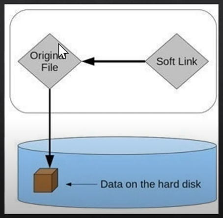

- Không trỏ thẳng trực tiếp đến vùng nhớ của ổ cứng mà sẽ trỏ đến file gốc (giống như tạo shortcut trên Windows).
- Là một tập tin khác hoàn toàn.
- Nếu xóa file gốc thì symbolic link sẽ bị lỗi.

#### Lưu ý
- Symbolic link cho phép tạo link tới các tệp và thư mục ở các vị trí khác nhau trên hệ thống tệp.
- Có thể tạo, xóa hoặc di chuyển các symbolic link mà không ảnh hưởng đến tệp gốc.
- Symbolic link có thể trỏ tới các tệp và thư mục trên các ổ đĩa khác nhau.
- Truy cập có thể bị chậm hơn so với tệp gốc.

#### Khi nào sử dụng symbolic link
- Khi cần tạo liên kết các tệp và thư mục ở các vị trí khác nhau.
- Khi tạo các biến thể mà không làm ảnh hưởng đến tệp gốc.
- Khi cần liên kết giữa các ổ đĩa hoặc phân vùng khác.

**Cấu trúc:** `ln -s [file gốc] [slink]`

## Bash script

### `which`
Trả về một đường dẫn chứa tệp hoặc lệnh được thực thi.
- **Ví dụ:** `which bash`, `which ls`

### `whatis`
Trả về một mô tả ngắn giới thiệu về cách sử dụng của lệnh.
- **Ví dụ:** `whatis ls`, `whatis cat`, …

---

## USER

### `useradd`
Dùng để tạo người dùng mới.
- **Flag:**
  - `-m`: Dùng để tạo thư mục chính mặc định cho người dùng này.
  - `-s`: Dùng để mặc định shell, ví dụ `-s /usr/bin/bash`.
  - `-g`: Chỉ định nhóm người dùng, ví dụ `-g users` hoặc `-g root`.
  - `-c`: Thêm các mô tả về người dùng này, ví dụ `-c "This is a root user"`.
  - `-aG`: `a` thêm người dùng vào nhóm mà không loại bỏ họ khỏi các nhóm khác đang thuộc về. `G` chỉ định các nhóm bổ sung mà người dùng sẽ tham gia.

### `userdel`
Dùng để xóa người dùng.
- **Flag:** Nếu không có flag thì sẽ xóa hết, chừa lại thư mục home của người dùng đó => giúp quản lý được nội dung, dữ liệu của người đã làm.
  - `-r`: Xóa hết tất cả kể cả thư mục home của người dùng.

### `usermod`
Thêm người dùng vào nhóm bất kỳ.
- **Flag:**
  - `-a`: Thêm người dùng vào nhóm mà không loại bỏ khỏi các nhóm đang ở hiện tại.
  - `-G`: Chỉ định các nhóm bổ sung mà sẽ tham gia.
- **Ví dụ:** `sudo usermod -aG root AnPhuc`

### Thiết lập chính sách (policy) cho user – `chage`
**Cú pháp:** `chage [option] login_name`
- **Flag:**
  - `-l`: Xem chính sách của user.
  - `-E`: Thiết lập ngày hết hạn account.
  - `-I`: Thiết lập số ngày bị khóa sau khi mật khẩu hết hạn.
  - `-m`: Thiết lập số ngày tối thiểu cho phép thay đổi password.
  - `-M`: Số ngày tối đa.
  - `-W`: Số ngày cảnh báo trước khi hết hạn mật khẩu.

---

## GROUP Management

Đường dẫn đến tệp chứa các nhóm đang có ở trên máy: `/etc/group`

### `groups`
Xem người dùng hiện tại đang ở những nhóm nào.

**Ví dụ:**
```
┌──(kali㉿kali)-[~]
└─$ groups
kali adm dialout cdrom floppy sudo audio dip video plugdev users netdev bluetooth scanner wireshark kaboxer
```

### `groupadd`
Thêm nhóm.
- **Flag:**
  - `-g`: Xác định GID của nhóm.

### `groupdel`
Xóa nhóm.

### `groupmod`
Sửa thông tin nhóm.
- **Flag:**
  - `-g`: Sửa GID.
  - `-n`: Sửa tên nhóm.

### `gpasswd`
Thêm người dùng vào một nhóm.
- **Flag:**
  - `-a`: Thêm người dùng vào nhóm.
  - `-d`: Xóa người dùng khỏi nhóm.

**Ví dụ:**
```
┌──(kali㉿kali)-[/var/log/apt]
└─$ sudo gpasswd -a AnPhuc adm
Adding user AnPhuc to group adm
```

### `.bashrc`
File được thực thi khi bắt đầu mở một session mới.

### `df`
Hiển thị, báo cáo dung lượng ổ đĩa trống đang được hệ thống sử dụng.

### `du`
Hiển thị các tệp và dung lượng ổ đĩa ở tại một thư mục nào đó.
- **Flag:**
  - `-h`: Hiển thị giá trị cho người có thể đọc.
  - `-s`: Tóm tắt và hiển thị tổng dung lượng có trong thư mục.

### `free`
Hiển thị tổng dung lượng còn trống và đã được sử dụng.
- **Flag:** `-m`, `-g`, `-t`

### `watch`
Lệnh thực thi lặp đi lặp lại 1 tiến trình trong một khoảng thời gian (mặc định là 2s).
- **Flag:**
  - `-n [số]`: Số giây xuất được thực thi.

**Ví dụ:**
```
┌──(AnPhuc㉿kali)-[~]
└─$ watch -n 1 df -h
```

---

## Lịch & Lệnh ngày giờ (CALENDAR_COMMAND)

### `cal`
In ra lịch tháng hiện tại trên máy.

### `date`
In ra ngày, giờ hiện tại của máy.
- **Flag:**
  - `-s`: set, thay đổi ngày giờ trên máy. Ví dụ: `+%h %d %y %D …`

### Thực thi nhiều lệnh trên cùng một dòng
- Sử dụng `;` để ngăn cách giữa nhiều lệnh. Ví dụ: `ls ; pwd`
  - Nếu một lệnh bị lỗi, nguyên câu lệnh vẫn có thể thực thi.
- Sử dụng `&&`. Ví dụ: `ls && pwd && date`
  - Nếu một lệnh bị lỗi, nguyên câu lệnh sẽ không thể thực thi.
- Sử dụng `||`. Nếu một lệnh đúng thì lệnh phía sau sẽ không thực thi, và ngược lại.

## Cài đặt và cấu hình mạng

### Các file cấu hình network

#### `/etc/hosts`
Dùng để phân giải hostname không thể phân giải được, sử dụng để thay DNS.

#### `/etc/resolv.conf`
Chỉ định DNS server để phân giải tên miền.

### Định dạng card mạng
- `ls /sys/class/net`

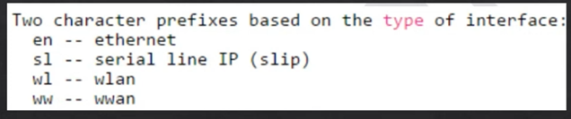

### Các lệnh network

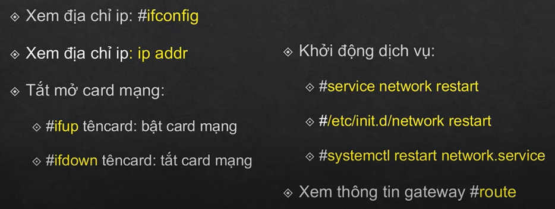

### Cấu hình địa chỉ IP

#### Cấu hình bằng lệnh

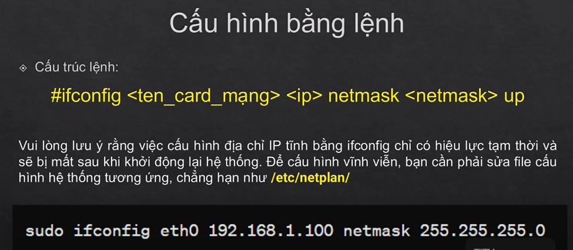

#### Cấu hình trên file

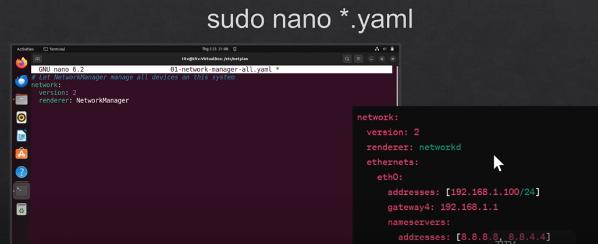

#### Cấu hình trên giao diện
- Sử dụng `nmtui`.

## Linux File Systems

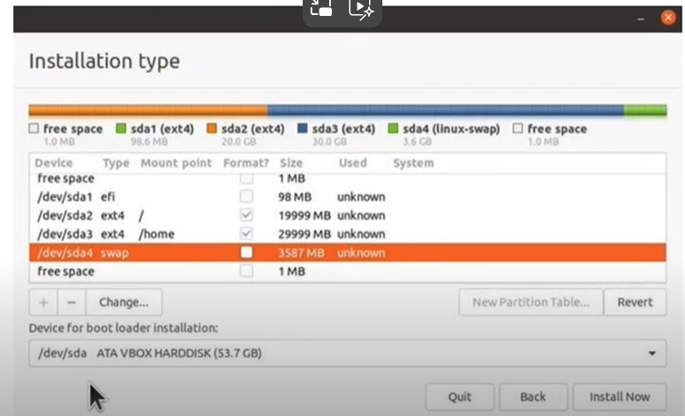

### Hệ thống tệp (File System)
Là cơ chế tổ chức và quản lý các tệp và thư mục trên ổ đĩa. Các hệ thống tệp phổ biến trong Linux bao gồm:
- **ext4**: Hệ thống tệp mặc định và phổ biến nhất, hỗ trợ các tính năng như journaling, hỗ trợ kích thước tệp và hệ thống tệp lớn.
- **XFS**: Hệ thống tệp hiệu suất cao, thích hợp cho các ứng dụng yêu cầu quản lý tệp lớn.
- **Btrfs**: Hệ thống tệp hiện đại với nhiều tính năng như snapshot, RAID, và tự sửa lỗi.
- **FAT32/NTFS**: Thường được sử dụng cho các thiết bị lưu trữ di động để tương thích với cả Linux và Windows.

### Một số lệnh dùng để quản lý ổ cứng
- `fdisk`: Để phân chia phân vùng (partition) của ổ cứng.

## Lập trình SHELL
- Là việc viết ra các tập lệnh (script) để thực hiện các tác vụ trong môi trường dòng lệnh.
- Script shell thường được sử dụng để tự động hóa các công việc lặp đi lặp lại hoặc để thực hiện các tác vụ phức tạp.

### Các loại shell thông dụng trên Unix/Linux
- **sh (shell Bourne)**: Shell nguyên thủy có mặt trên hầu hết các hệ thống Linux. Rất hữu dụng cho việc lập trình shell nhưng nó không xử lý tương tác người dùng như các shell khác…
- **Bash**: Phần mở rộng của sh, kế thừa những gì sh đã có và phát huy những gì sh chưa có. Đây là shell mặc định trên các hệ thống Linux.
- **Csh, tcsh và zsh**: Dòng shell sử dụng cấu trúc của C. Là shell thông dụng thứ 2 sau bash shell.

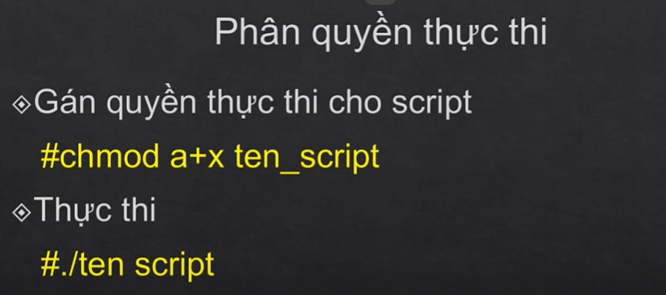

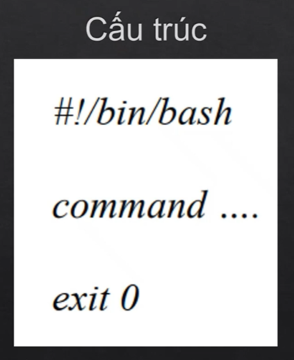

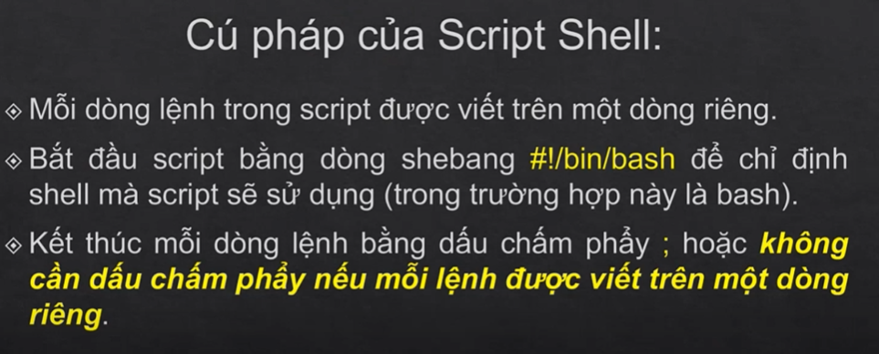

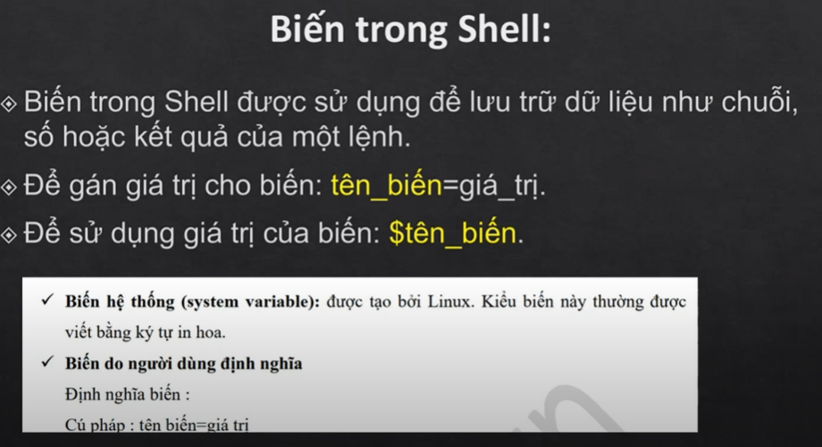

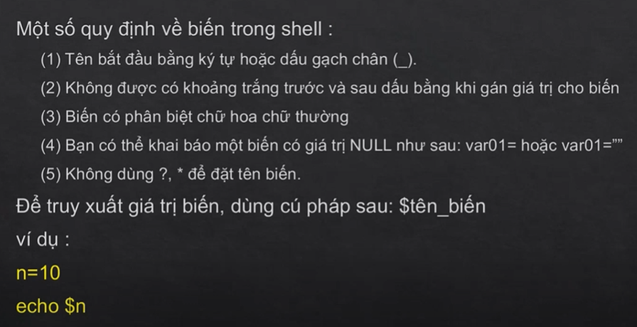

## Lệnh nhập/xuất nâng cao

### Nhập
- Sử dụng `read` để nhập dữ liệu từ bàn phím.
- **Flags:**
  - `-p` (`--prompt`): Chỉ định thông báo cho người dùng nhập.
    - `read -p "Nhập tên zô: " name`
  - `-s` (`--silent`): Nhập mật khẩu mà không hiển thị dữ liệu đang nhập.
    - `read -s -p "Nhập mật khẩu: " password`
  - `-r` (`--raw`): Đọc mà không thực hiện xử lý như `\` và `$`: `read -r line`
  - `-a` (array): Đọc dữ liệu và lưu vào mảng.
    - `read -a names`
  - `read -rsp "Nhập mk: " password`

### Xuất
- `echo` kết hợp backticks (`` ` ``) hoặc `$(command)` để lồng lệnh.
- `$name = "phuc"`: Gán 1 biến.
- Hiển thị `echo "Today is $(date)"` hoặc dùng backticks thay cho `$`: `echo "Today is `date`"`
- `\`: Nếu muốn xuất ra ký tự đặc biệt, ví dụ: `\"`

## Tính toán

- `"`: Nháy kép, bất cứ gì nằm trong dấu được xem là những ký tự riêng biệt.
- `'`: Nháy đơn, những gì nằm trong dấu nháy có ý nghĩa không đổi.
- `` ` ``: Nháy ngược, thực thi lệnh.

### Sử dụng `expr`
Thực hiện các phép toán:
```
expr 1 + 3
expr 2 - 1
expr 10 / 2
```

### Sử dụng `let`
Dành riêng cho shell, vừa tính toán vừa gán vào 1 biến nào đó:
```
let "z=$z+3"
```

### Sử dụng `$((...))`
```
z=$((z+3))
z=$(($m*$n))
```